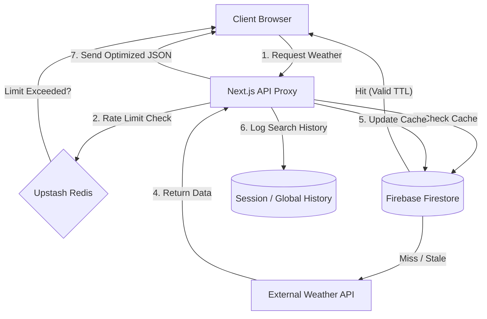

# Weather API Proxy & Resilient Middleware

## Overview
This project is a full-stack API Proxy that sits between a client application and external weather APIs. Its primary goals are:
- Protect API Keys — prevent exposure in client apps.
- Reduce Costs — limit unnecessary external API calls.
- Ensure Reliability — serve cached data even under API failures.

The system uses multi-tier caching, IP-based rate limiting, and stale-while-revalidate logic to provide fast, resilient responses to end-users.

---

## System Architecture
The proxy acts as a gateway, controlling data flow between client, cache, and external providers.



## Key Features
1. Proxy Pattern
    - Keeps API keys secure on the server.
    - Prevents client-side exposure while serving filtered data.

2. Multi-Tier Caching
    - Uses Firestore as a persistent cache (TTL = 5 min).
    - Reduces external API calls for repeated queries.

3. Hybrid Rate Limiting
    - Soft Limit: Cached requests get a higher allowance.
    - Hard Limit: External API requests are throttled strictly.
    - Implemented with Redis (Upstash) for serverless scalability.

4. Resilient Error Handling
    - Exponential backoff for retries on API failures.
    - Stale-while-revalidate: Serve near-fresh cached data while refreshing in the background.

5. Client-Side Search History
    - Tracks recent searches in React state.
    - Updates instantly in the UI, no server storage required.

## Tech Stack
- Frontend: React 18, Tailwind CSS (Dynamic Weather UI)
- Backend: Next.js Serverless Functions (API Routes)
- Cache / Rate Limit: Redis (Upstash)
- Database / Cache Store: Firebase Firestore
- Authentication: Firebase Auth (user-scoped history)
- Type Safety: TypeScript interfaces for API responses

## Local Setup
1. Clone repository
```
git clone https://github.com/rabebe/api-caching-proxy.git
cd api-caching-proxy
```

2. Install dependencies
```
npm install
```
3. Configure environment variables
    Create a .env.local file

```
# Firebase
NEXT_PUBLIC_FIREBASE_API_KEY="AIza..."
NEXT_PUBLIC_FIREBASE_PROJECT_ID="your-project-id"

# Redis (Rate Limiting)
REDIS_URL="https://..."

# Weather Provider
WEATHER_API_KEY="your_secret_key"
```
4. Run development server
```
npm run dev
```

The app will run at http://localhost:3000

## Future Improvements
- Edge caching via Vercel Edge Functions for <20ms latency.
- Aggregating multiple weather providers for consensus-based forecasts.
- Analytics dashboard to track cache hit/miss rates and API cost savings.