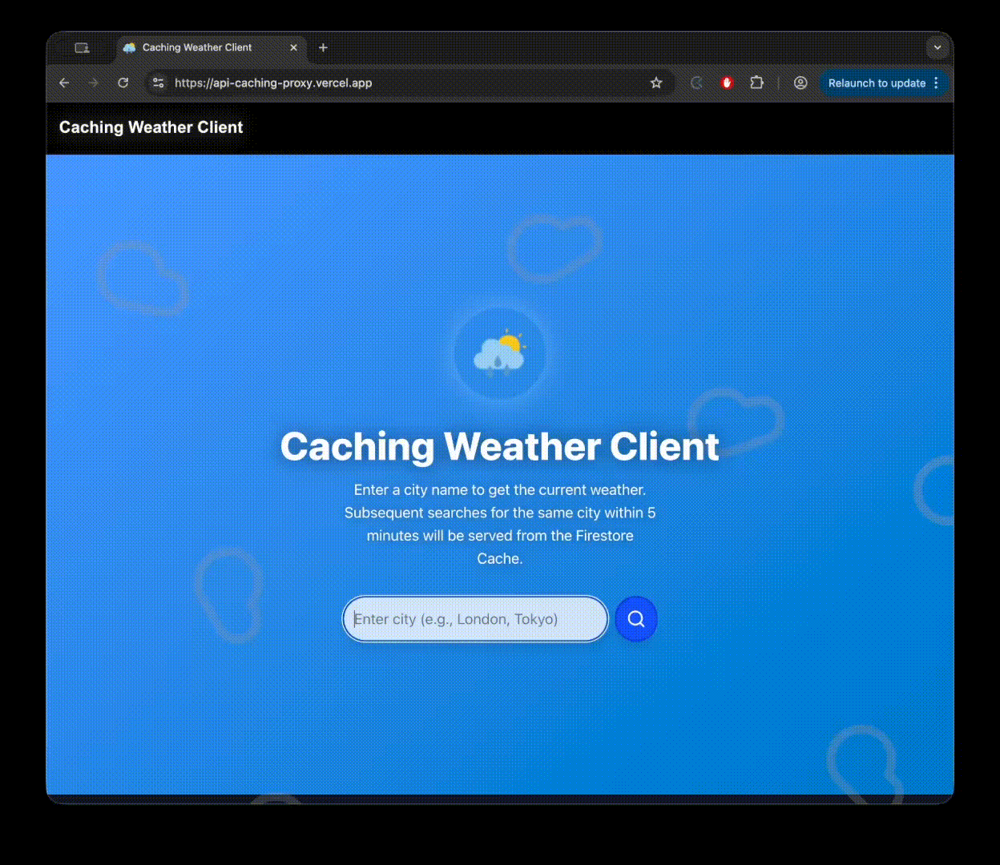
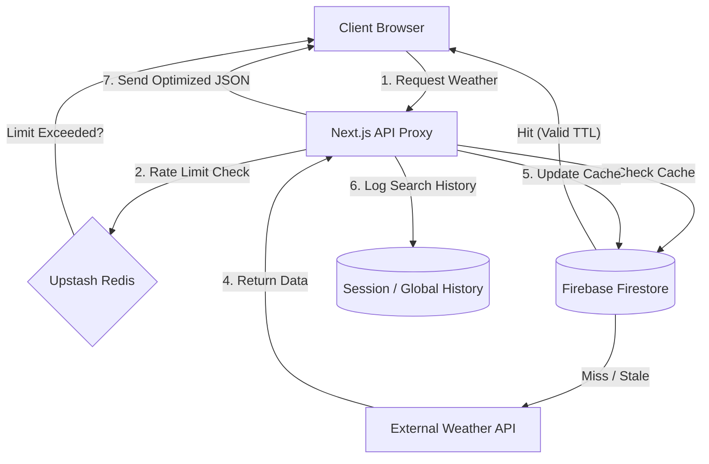
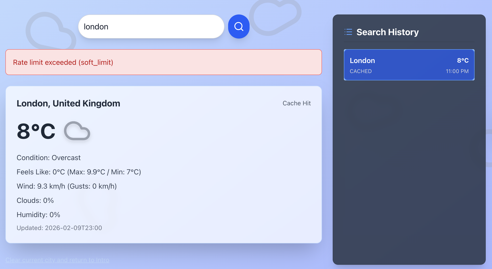

# Weather API Proxy & Resilient Middleware
A high-performance Next.js API Gateway designed to sit between client applications and external weather providers. This project demonstrates advanced backend patterns: Multi-tier caching, Distributed Rate Limiting, and the Stale-While-Revalidate resilience strategy.

---

## Key Features
- Security-First Proxy: Eliminates client-side exposure of sensitive API keys by handling all external requests server-side.
- Hybrid Rate Limiting: Implements tiered thresholds (Soft vs. Hard) using Upstash Redis to prioritize cached content.
- Intelligent Caching: Uses Firestore as a persistent cache layer with custom TTL (Time-To-Live) logic to minimize external API costs.
- Resilient Fallbacks: Serves stale data during provider outages while attempting background refreshes (Stale-While-Revalidate).
- Dynamic UI: A React-based dashboard that adapts visuals based on real-time weather conditions and maintains a local search history.

---

## Live Workflow Demo


---

## System Architecture


---

## Hybrid Rate Limiting Logic
- Soft Limit: Cached requests per IP per minute (e.g., 5).
- Hard Limit: Fresh API requests per IP per hour (e.g., 20).

```typescript
import { allowRequest } from './rateLimit';

const { allowed, reason } = await allowRequest(userIp, isApiCall);

if (!allowed) {
  return res.status(429).json({ error: `Rate limit exceeded (${reason})` });
}
```
- Soft requests are served from cache without affecting API quota.
- Hard requests count against the actual API to prevent overuse.
- Atomic counters and TTL in Redis ensure safe multi-server usage.

---

## Resilience Logic

To ensure a seamless user experience even when external providers fail:
- **Stale-While-Revalidate:** Firestore returns stale data if it's older than 5 minutes while background updates occur asynchronously.
- **Tiered Allowance:** Protects external API budget by prioritizing cached responses and limiting direct API calls.

---

## Tech Stack
- **Framework:** Next.js (Serverless API Routes)
- **State/UI:** React 18+, Tailwind CSS
- **Caching/Storage:** Firebase Firestore
- **Rate Limiting:** Upstash Redis
---

## Project Structure
```text
├── src/
│   ├── app/
│   │   ├── api/
│   │   │   └── weather/     
│   │   │   │   └── route.ts # Proxy, caching, and hybrid rate limiter
│   │   └── page.tsx         # Weather dashboard UI
│   ├── components/          # Reusable UI components
│   ├── utils/
│   │   ├── cache.ts         # Firestore caching logic
│   │   └── firebase.ts      # Firestore configuration
│   │   └── rateLimit.ts     # Redis rate limiting logic
│   │   └── weatherAPI.ts    # External API interaction logic
```

---

## Route Behaviour (route.ts)
1. Check Cache First
    - Apply soft limit for cached responses.
2. Enforce Hard Limit for API Calls
    - Prevent exceeding external provider quotas.
3. Fetch Fresh Weather
    - Update Firestore cache.
4. Fallbacks
    - Return stale cache if available when API call fails or hard limit is exceeded.

```typescript
const cached = await getCachedData<WeatherData>(cacheKey, 'weather_cache');
if (cached && isCacheValid(cached)) {
  const { allowed, reason } = await allowRequest(ip, false); // soft limit
  if (!allowed) return NextResponse.json({ error: `Rate limit exceeded (${reason})` }, { status: 429 });
  return NextResponse.json({ ...cached.data, source: 'cache' });
}

// Hard limit for fresh API requests
const { allowed: apiAllowed, reason: apiReason } = await allowRequest(ip, true);
if (!apiAllowed) return NextResponse.json({ ...cached?.data, error: `Rate limit exceeded (${apiReason})` });
```


---

## Setup & Local Development
1. Installation
```bash
git clone https://github.com/rabebe/api-caching-proxy.git
cd api-caching-proxy
npm install
```

2. Environment Variables (.env.local)
```env
# Firebase Configuration
NEXT_PUBLIC_FIREBASE_API_KEY="your_api_key"
NEXT_PUBLIC_FIREBASE_PROJECT_ID="your_project_id"

# Rate Limiting (Upstash)
REDIS_URL="your_upstash_redis_url"
REDIS_TOKEN="your_upstash_token"

# External Provider
WEATHER_API_KEY="your_secret_provider_key"
```

3. Execution
```bash
npm run dev
```

## License
This project is licensed under the MIT License - see the [LICENSE](LICENSE) file for details.